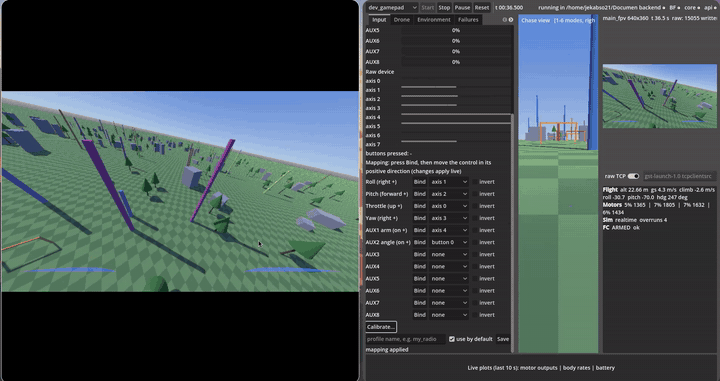

# fpvsim

Graphical software-in-the-loop simulator for fast FPV drones that run Betaflight. The real
Betaflight firmware runs on the PC as a SITL binary; fpvsim provides the physics, sensors,
environment, camera video, link emulation, failure injection and test automation around it.

`fpvsim` is a working name. Linux only; Fedora is the development platform.

> **Status: early development.** This project is not ready for use. Do not rely on it for
> production work or for developing, testing or validating firmware, hardware or flight
> behaviour. Interfaces, configs and results change without notice, and the physics is not yet
> implemented or validated.

## Demo



[Full video](demo/2026-09-22_14-03-44.mp4): flying with a RadioMaster Boxer, chase and FPV views,
and the video output in a GStreamer window.

## Setup

```bash
git submodule update --init third_party/betaflight
./scripts/bootstrap_fedora.sh       # system dependencies (dnf, needs sudo)
./scripts/bf_build.sh               # Betaflight SITL -> build/betaflight/betaflight_SITL.elf
cmake --preset dev && cmake --build --preset dev
ctest --preset dev
cd tools && uv sync && uv run pytest && cd ..    # add -m integration for the SITL flight test
godot --headless --path app -s tests/run_tests.gd  # GDScript unit tests
pre-commit install
```

CMake presets: `dev` (GCC, Debug, ASan and UBSan), `clang` (Clang, warnings as errors),
`release`, `ci` (GCC, warnings as errors).

## Run

```bash
./scripts/run_app.sh                                        # GUI app; starts simctl serve itself
./scripts/run_app.sh -- --attach                            # GUI attached to a running simctl run
./scripts/run_app.sh -- --screenshot /tmp/app.png           # save the window content and quit
uv run --project tools simctl validate configs/sessions/ci_hover.yaml
uv run --project tools simctl run configs/sessions/ci_hover.yaml --headless   # hover test flight, run dir in runs/
uv run --project tools python tools/spikes/spin_motors.py   # arm Betaflight SITL, read motors
uv run --project tools python tools/spikes/radio_passthrough.py --duration 60   # USB radio -> SITL
./scripts/configurator_bridge.sh                            # WebSocket bridge for app.betaflight.com
```

## License

Betaflight is GPLv3. It runs as a separate process and is never linked into fpvsim binaries.
The patches in `patches/betaflight/` are GPLv3 like Betaflight.
